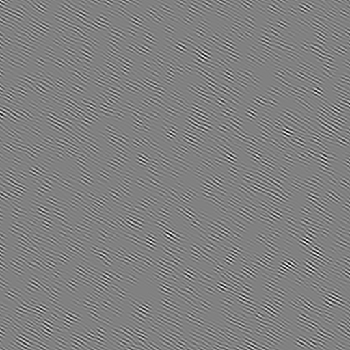
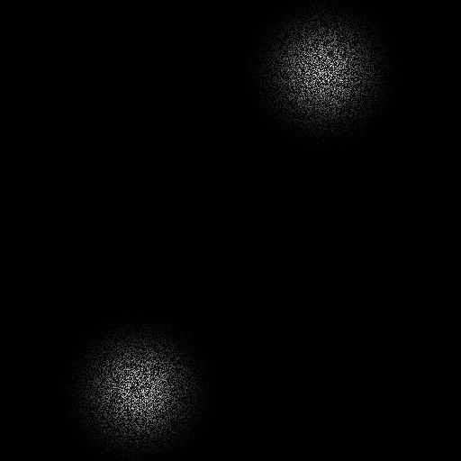

# 2020春学期南京大学图形绘制技术课程
* 作业四 [作业四报告](./BlueNoiseSampling/README.md)
* 大作业 [大作业报告](./README.md)

# 大作业 Gabor噪声生成与渲染
## 171860633 徐国栋

### 问题描述
1. 计算参数可控的 Gabor 核及其理论频谱、Gabor 噪声及其理论频谱
2. 利用噪声叠加、函数处理和颜色映射表生成花瓶条纹、云朵纹理和火焰纹理
3. 在 mitsuba 中渲染两个三维场景：布料和球体

### 测试案例
* 使用mitsuba的示例
```shell
wget http://www.mitsuba-renderer.org/scenes/irawan.zip      # 布料
wget http://www.mitsuba-renderer.org/scenes/matpreview.zip  # 球体
```
* 应用在三维物体上的渲染效果如下：
<table width="100%" border="0" cellspacing="0" cellpadding="0">
  <tr>
<td align="center"></td>
<td align="center"></td>
<td align="center"></td>
<td align="center"></td>
<td align="center"></td>
  </tr>
  <tr>
<td align="center"></td>
<td align="center"></td>
<td align="center"></td>
<td align="center"></td>
<td align="center"></td>
  </tr>
    <tr>
<td align="center"></td>
<td align="center"></td>
<td align="center"></td>
<td align="center"></td>
<td align="center"></td>
</tr>
</table>
    
### 解决思路
1. 参数可控的Gabor核的生成
* 这里的Gabor核是高斯核(Gaussian Envelop)与谐波的乘积，可以在大小、频率和宽度方面进行参数化，具体而言，是通过控制高斯核的峰值K、宽度a以及谐波的频率F0、方向ω0进行参数化。
* Gabor核在空间域的计算公式如下：
$$g(x, y)=K e^{-\pi a^{2}\left(x^{2}+y^{2}\right)} \cos \left[2 \pi F_{0}\left(x \cos \omega_{0}+y \sin \omega_{0}\right)\right]$$
* Gabor核在频域的计算公式如下：
$$G\left(f_{x}, f_{y}\right)=\frac{K}{2 a^{2}}\left\{e^{-\frac{\pi}{a^{2}}\left[\left(f_{x}-F_{0} \cos \omega_{0}\right)^{2}+\left(f_{y}-F_{0} \sin \omega_{0}\right)^{2}\right]}+e^{-\frac{\pi}{a^{2}}\left[\left(f_{x}+F_{0} \cos \omega_{0}\right)^{2}+\left(f_{y}+F_{0} \sin \omega_{0}\right)^{2}\right]}\right\}$$
* 对应的代码实现为：
```cpp
class GaborKernel {
    float K, a, F0, w0;
public:
    float atSpatial(float _x, float _y) const {     // 2-3节，公式(6) Gabor核在空间域的取值
        const float envelop = K * exp(-M_PI * a * a * (_x * _x + _y * _y)),
                harmonic = cos(2.0 * M_PI * F0 * (_x * cos(w0) + _y * sin(w0)));
        return envelop * harmonic;
    }
    float atFrequency(float _fx, float _fy) const { // 2-3节，公式(7) Gabor核在频域的取值
        const float fc0 = F0 * cos(w0), fs0 = F0 * sin(w0);
        return K * (exp(-M_PI / a / a * (powf(_fx - fc0, 2) + powf(_fy - fs0, 2))) 
                + exp(-M_PI / a / a * (powf(_fx + fc0, 2) + powf(_fy + fs0, 2)))) / 2.0 / a / a;
    }
};
```
* 调用GaborKernel的示例如下：
```cpp
    GaborKernel gk(K, a, F0, w0 / 180 * M_PI);
    float scale = 1 / 16.0; // 可视化对应参数下的Gabor核
    for (int i = 0; i < 256; i++) {
        for (int j = 0; j < 256; j++) {
            float x = (i - 128) * scale, y = (j - 128) * scale;
            vec256[i][j] = gk.atSpatial(x, y);
        }
    }
    scale = 2 / 256.0;      // 可视化对应参数下的Gabor核的理论频谱
    for (int i = 0; i < 256; i++) {
        for (int j = 0; j < 256; j++) {
            float x = (i - 128) * scale, y = (j - 128) * scale;
            vec256[i][j] = gk.atFrequency(x, y);
        }
    }
```
* 在256×256分辨率、空间域1:16插值、频域1:128插值显示时，不同控制参数对应的Gabor核可视化如下：
<table width="100%" border="0" cellspacing="0" cellpadding="0">
  <tr>
<td align="center"></td>
<td align="center"></td>
<td align="center"></td>
<td align="center"></td>
<td align="center"></td>
</tr>
<tr>
    <td align="center">K=1, a=0.15, F0=0.1, ω0=0</td>
    <td align="center">K=1, a=0.15, F0=0.2, ω0=30</td>
    <td align="center">K=1, a=0.30, F0=0.2, ω0=60</td>
    <td align="center">K=1, a=0.30, F0=0.4, ω0=90</td>
    <td align="center">K=1, a=0.30, F0=0.8, ω0=120</td>
  </tr>
  <tr>
<td align="center"></td>
<td align="center"></td>
<td align="center"></td>
<td align="center"></td>
<td align="center"></td>
</tr>
</table>

* 上面的结果没有对高斯核强度K进行区分，因为显示的时候，脉冲的值被归一化到0-255，高斯核强弱没有能够表达
* 直观来看，高斯核宽度a表达了空间域滤波器宽度和频域脉冲宽度，谐波频率F0表达了空间域条纹疏密和频域脉冲间距，谐波方向ω0直接控制滤波器方向
</br>
</br>
</br>
</br>
2. 参数可控的Gabor噪声的生成
* Gabor噪声是Gabor核与稀疏白噪声的卷积，和计算机视觉中用滤波器划过图像的卷积方式不同，这里使用脉冲叠加的方式。具体来说，设置参数kernel_radius，将空间域划分成每格大小为kernel_radius×kernel_radius的网络，每个坐标会落在一个格子里，这个坐标处的噪声取值为以这个格子为中心的九宫格里所有脉冲的叠加。这一步对应于论文附录的noise函数

* 对于每一个格子里脉冲的计算，也就是上一步需要累加的九宫格的脉冲，因为不存在记录每个格子脉冲的全局信息(论文认为这是一种节约内存的行为)，又注意到不同坐标的噪声值是独立计算的，而某个格子的脉冲会影响到很多坐标(x,y)处噪声值的计算，这里使用的技巧是，利用莫顿码标识网格的唯一性，用特定莫顿码作为种子初始化随机数生成器，从而保证不同坐标获取的同一网格的脉冲是相同的。这一步对应于论文附录的cell函数

* Gabor噪声分为各向异性和各向同性(这里指的是生成环节，不包括各向异性滤波)，实现的区别是，各向异性的Gabor噪声，每个网格的Gabor核方向相同；各向同性的Gabor噪声，每个网格的Gabor核方向随机

* Gabor噪声的控制参数有：属于Gabor核的参数：高斯核的峰值K、宽度a以及谐波的频率F0、方向ω0；各向异性或者各向同性isIsotropic；每个网格存放包含多少脉冲(也就是Gabor核)number_of_impulses_per_cell；网格大小kernel_radius和用于配合莫顿码使用的random_offset。random_offset在生成一次Gabor噪声的过程里不发生变化，从而可以达到一次生成过程里标识网格唯一性，多次生成过程里构造噪声的随机性

* 空间域的代码实现(论文附录有)：
```cpp
    float noise(float _x, float _y) {
        _x /= kernel_radius;
        _y /= kernel_radius;
        float res = 0;
        // 确定(_x,_y)所属的网格以及其周围的八个网格
        for (int i = -1; i <= 1; i++) {
            for (int j = -1; j <= 1; j++) {
                res += cell(
                    floor(_x) + i, floor(_y) + j, frac(_x) - i, frac(_y) - j
                );
            }
        }
        return res;
    }
```
```cpp
    float cell(int i, int j, float x, float y) {
        auto s = morton(i, j) + random_offset;
        if (s == 0)s = 1;
        PseudoRandomNumberGenerator prng(s);
        auto number_of_impulses = prng.poisson(number_of_impulses_per_cell);
        float res = 0;
        if (isIsotropic) {
            for (unsigned i = 0; i < number_of_impulses; i++) {
                auto xi = prng.rand01(), yi = prng.rand01();
                // wi代表白噪音，随机变量wi均值为0,见2.2节公式3
                auto wi = prng.randin(-1, 1);
                // 各向同性噪声：每一次都重置Gabor核的方向
                kernel.setHarmonicOrientation(prng.randin(0.0, 2.0 * M_PI));
                res += wi * kernel.atSpatial(
                    (x - xi) * kernel_radius,(y - yi) * kernel_radius
                );
            }
        } else {
            for (unsigned i = 0; i < number_of_impulses; i++) {
                auto xi = prng.rand01(), yi = prng.rand01();
                auto wi = prng.randin(-1, 1);
                res += wi * kernel.atSpatial(
                    (x - xi) * kernel_radius,(y - yi) * kernel_radius
                );
            }
        }
        return res;
    }
```
* 理论频谱的计算公式
* 各向异性的Gabor噪声由同一个Gabor核叠加，公式如下：
$$S_{N N}\left(f_{x}, f_{y}\right)=\lambda E\left[W^{2}\right]\left|G\left(f_{x}, f_{y}\right)\right|^{2}$$
* 各向同性的Gabor噪声由大小相同方向不同的Gabor核叠加，公式如下：
$$S_{N N}\left(f_{r}\right) \approx \lambda E\left[W^{2}\right] \frac{K^{2}}{4 \sqrt{2} \pi F_{0} a^{3}} e^{\frac{-2 \pi}{a^{2}}\left(f_{r}-F_{0}\right)^{2}}$$
* 公式里的W代表白噪音，随机变量W的均值为0
* 频域的代码实现
```cpp
    float frequency(float _x, float _y) {
        if (isIsotropic) {  // 论文3.1节公式14
            PseudoRandomNumberGenerator prng(rand());
            auto wi = prng.rand01();
            float delta = sqrt(_x * _x + _y * _y) - F0;
            return wi * wi * K * K / (4 * sqrt(2) * M_PI * F0 * a * a * a) * 
                      exp(-2 * M_PI / a / a * delta * delta);
        } else {            // 论文2.4节公式10
            PseudoRandomNumberGenerator prng(rand());
            auto wi = prng.rand01();
            return wi * wi * kernel.atFrequency(_x, _y);
        }
    }
```
* 使用不同的kernel参数
* 各向异性Gabor噪声可视化结果如下：
<table width="100%" border="0" cellspacing="0" cellpadding="0">
  <tr>
<td align="center"></td>
<td align="center"></td>
<td align="center"></td>
<td align="center"></td>
<td align="center"></td>
</tr>
<tr>
    <td align="center">K=1, a=0.15, F0=0.1, ω0=0</td>
    <td align="center">K=1, a=0.15, F0=0.2, ω0=30</td>
    <td align="center">K=1, a=0.30, F0=0.2, ω0=60</td>
    <td align="center">K=1, a=0.30, F0=0.4, ω0=90</td>
    <td align="center">K=1, a=0.30, F0=0.8, ω0=120</td>
  </tr>
  <tr>
<td align="center"></td>
<td align="center"></td>
<td align="center"></td>
<td align="center"></td>
<td align="center"></td>
</tr>
</table>

* 各向同性Gabor噪声可视化结果如下：
<table width="100%" border="0" cellspacing="0" cellpadding="0">
  <tr>
<td align="center"></td>
<td align="center"></td>
<td align="center"></td>
<td align="center"></td>
<td align="center"></td>
</tr>
<tr>
    <td align="center">K=1, a=0.15, F0=0.1, ω0=0</td>
    <td align="center">K=1, a=0.15, F0=0.2, ω0=30</td>
    <td align="center">K=1, a=0.30, F0=0.2, ω0=60</td>
    <td align="center">K=1, a=0.30, F0=0.4, ω0=90</td>
    <td align="center">K=1, a=0.30, F0=0.8, ω0=120</td>
  </tr>
  <tr>
<td align="center"></td>
<td align="center"></td>
<td align="center"></td>
<td align="center"></td>
<td align="center"></td>
</tr>
</table>

* 控制kernel参数一样，调成网格大小kernel_radius以及Gabor核密度number_of_impulses_per_cell
* 各向异性Gabor噪声可视化结果如下：
<table width="100%" border="0" cellspacing="0" cellpadding="0">
  <tr>
<td align="center"></td>
<td align="center"></td>
<td align="center"></td>
<td align="center"></td>
<td align="center"></td>
</tr>
<tr>
    <td align="center">网格大小=2, 每格脉冲数=10</td>
    <td align="center">网格大小=4, 每格脉冲数=10</td>
    <td align="center">网格大小=8, 每格脉冲数=10</td>
    <td align="center">网格大小=16, 每格脉冲数=10</td>
    <td align="center">网格大小=8, 每格脉冲数=1</td>
  </tr>
</table>

* 各向同性Gabor噪声可视化结果如下：
<table width="100%" border="0" cellspacing="0" cellpadding="0">
  <tr>
<td align="center"></td>
<td align="center"></td>
<td align="center"></td>
<td align="center"></td>
<td align="center"></td>
</tr>
<tr>
    <td align="center">网格大小=2, 每格脉冲数=10</td>
    <td align="center">网格大小=4, 每格脉冲数=10</td>
    <td align="center">网格大小=8, 每格脉冲数=10</td>
    <td align="center">网格大小=16, 每格脉冲数=10</td>
    <td align="center">网格大小=8, 每格脉冲数=1</td>
  </tr>
</table>

3. 花瓶条纹、云朵纹理和火焰纹理的生成
* 首先实现颜色映射表，功能是预先输入若干组键值对<float,color>，能够根据后面输入的float键插值生成对应的颜色
```cpp
using ColorMapData=vector<pair<float, QColor>>;
class ColorMap {
public:
    // 添加一组键值对节点
    void add(const float key, const QColor &color) {
        m_colorMapData.emplace_back(make_pair(key, color));
    }
    // 添加完进行排序
    void sort() {
        std::sort(m_colorMapData.begin(), m_colorMapData.end(),
        [=](const pair<float, QColor> &a, const pair<float, QColor> &b) {
            return a.first < b.first;
        });
    }
    QColor get(const float key) const {
        if (key < firstKey()) {
            return interp(0, firstKey(), key, Qt::black, getColor(0));
        } else if (key > lastKey()) {
            return interp(
                lastKey(), 1, key, getColor(m_colorMapData.size() - 1), Qt::black
            );
        }
        for (size_t i = 0; i < m_colorMapData.size() - 1; i++) {
            const auto &c1 = m_colorMapData[i];
            const auto &c2 = m_colorMapData[i + 1];
            if (c1.first <= key && key <= c2.first)
                return interp(c1.first, c2.first, key, c1.second, c2.second);
        }
        return Qt::black;
    }
private:
    ColorMapData m_colorMapData;
    ... some functions
    float interp(float x, float x0, float x1, float y0, float y1) const {
        auto dx = x1 - x0;
        if (abs(dx) < 1e-6)
            return (y0 + y1) / 2.0;
        return y0 + (x - x0) / dx * (y1 - y0);
    }
    QColor interp(
        float key1, float key2, float key, const QColor &c1, const QColor &c2
    ) const {
        auto delta = (key2 - key1);
        auto r = interp(key, key1, key2, c1.red(), c2.red());
        auto g = interp(key, key1, key2, c1.green(), c2.green());
        auto b = interp(key, key1, key2, c1.blue(), c2.blue());
        return QColor(r, g, b);
    }
};
```

* 接下来是配色打表，经过尝试，得到下面一组比较靠谱的颜色映射表：
```cpp
    static vector<ColorMap> colorMaps;
    colorMaps.resize(4);
    auto &cloud = colorMaps[0];
    auto &fire = colorMaps[1];
    auto &stripe = colorMaps[2];
    auto &yellowHat = colorMaps[3];
    // 这些节点值是用取色器拿到的
    // 云
    cloud.add(255, QColor(255, 255, 255));
    cloud.add(200, QColor(79, 169, 245));
    cloud.add(0, QColor(255, 255, 255));
    // 花瓶条纹
    stripe.add(0, QColor(255, 255, 255));
    stripe.add(140, QColor(191, 191, 205));
    stripe.add(150, QColor(82, 81, 86));
    stripe.add(160, QColor(90, 91, 98));
    stripe.add(255, QColor(255, 255, 255));
    // 黄色草帽
    yellowHat.add(0, QColor(0, 0, 0));
    yellowHat.add(50, QColor(152, 115, 60));
    yellowHat.add(150, QColor(221, 195, 120));
    yellowHat.add(200, QColor(251, 237, 161));
    yellowHat.add(245, QColor(255, 247, 191));
    // 火焰
    fire.add(0, QColor(0, 0, 0));
    fire.add(50, QColor(175, 87, 29));
    fire.add(150, QColor(248, 172, 79));
    fire.add(200, QColor(247, 219, 200));
    fire.add(255, QColor(255, 255, 255));
```
* 在不同尺度对噪声进行采样叠加，使用余弦等函数进行处理
```cpp
  // 花瓶条纹
  for (int i = 0; i < 512; i++) {
        for (int j = 0; j < 512; j++) {
            float x = (i - 256) * scale, y = (j - 256) * scale;
            float tmp = gn.noise(x, y);//叠加不同尺度上的噪声
            for (float e = 0.5; e > 1 / 64.0; e /= 2.0) {
                MUL2(x, y);
                tmp += e * abs(gn.noise(x, y));
            }
            vec512[i][j] = cos(x / 16 + tmp);
        }
    }
```
```cpp
    // 云朵和火焰纹理
    for (int i = 0; i < 512; i++) {
        for (int j = 0; j < 512; j++) {
            float x = (i - 256) * scale, y = (j - 256) * scale;
            float tmp = gn.noise(x, y);//叠加不同尺度上的噪声
            for (float e = 0.5; e > 1 / 256.0; e /= 2.0) {
                MUL2(x, y);
                tmp += e * gn.noise(x, y);
            }
            vec512[i][j] = tmp;
        }
    }
```
* 用各向异性噪声获得花瓶条纹和火焰纹理；用各向同性噪声获得云朵纹理
* 一组效果和对应的参数如下：
<table width="100%" border="0" cellspacing="0" cellpadding="0">
  <tr>
<td align="center"></td>
<td align="center"></td>
<td align="center"></td>
<td align="center"></td>
<td align="center"></td>
</tr>
<tr>
    <td align="center">花瓶条纹-各向异性-1-0.2-0.25-0-8-32</td>
    <td align="center">火焰纹理-各向异性-1-0.2-0.25-0-8-10</td>
    <td align="center">云朵纹理-各向同性-1-0.2-0.25-0-8-32</td>
    <td align="center">噪声上色-各向同性-1-0.2-0.25-0-8-32</td>
    <td align="center">噪声上色-各向异性-1-0.2-0.25-0-8-32</td>
  </tr>
</table>

* 参数说明：横线分格的数字依次代表K、a、F0、ω0、格子大小、每格脉冲数
</br>
</br>
</br>

### 效果演示
#### 噪声和纹理生成的调试 Qt窗体应用
* 编译运行，依赖Qt5
* 使用CMake或者QMake构建
* 用CMake需要设置 CMakeLists.txt 中的 Qt5_DIR 指向对应目录
* 用QMake，直接用qt-creator打开 pro 文件，构建运行即可
* 编程环境：ubuntu20.04, g++9, qt-5.14.2
* 界面设计如下：
<table width="100%" border="0" cellspacing="0" cellpadding="0">
  <tr>
<td align="center"></td>
<td align="center"></td>
</tr>
<tr>
    <td align="center">启动界面和区域功能</td>
    <td align="center">滚轮或键盘控制参数</td>
  </tr>
    <tr>
<td align="center"></td>
<td align="center"></td>
</tr>
<tr>
    <td align="center">下拉菜单控制按钮行为</td>
    <td align="center">彩色纹理不显示理论频谱</td>
  </tr>
</table>

#### 用mitsuba把纹理图贴到物体表面

* mitsuba0.6.0 在 ubuntu20.04 下的编译
* 参考 https://github.com/mitsuba-renderer/mitsuba/issues/54 修改scons文件给Qt模块的命名
* 参考 https://github.com/mitsuba-renderer/mitsuba/issues/32 把Qt5和pkg-config关联
* 参考 https://github.com/mitsuba-renderer/mitsuba/issues/87 解决一个报错信息
* 参考 http://www.mitsuba-renderer.org/releases/current/documentation.pdf 安装除Qt外的依赖
```shell
(shell) $ git clone https://github.com/mitsuba-renderer/mitsuba.git
(python2.7) $ cd mitsuba && scons -j 8
```

* 根据mitsuba文档，```<texture type="bitmap" name="reflectance">```标签可以完成贴图过程
* ```<string name="filename" value="../云朵纹理-各向同性-1-0.2-0.25-0-8-32.jpg" />```指定贴图位置
* ```<string name="wrapMode" value="mirror" />```设置纹理查找表在uv值域外的行为，
* ```<string name="filterType" value="ewa" />```设置纹理过滤行为，取值ewa进行各向异性过滤
* 使用下面的格式进行贴图：
```xml
	<bsdf type="diffuse" id="gabor_tex">
		<texture type="bitmap" name="reflectance">
			<string name="filename" value="../../GaborNoise/img/tex.jpg" />
			<string name="wrapMode" value="mirror" />
			<string name="filterType" value="ewa" />
			<float name="maxAnisotropy" value="100" />
		</texture>
	</bsdf>
```

### 结论
1. Gabor噪声易于进行参数控制
2. Gabor噪声内存占用小，且不受分辨率限制
3. 在每格脉冲数较少时，Gabor噪声易于实现实时的纹理生成
