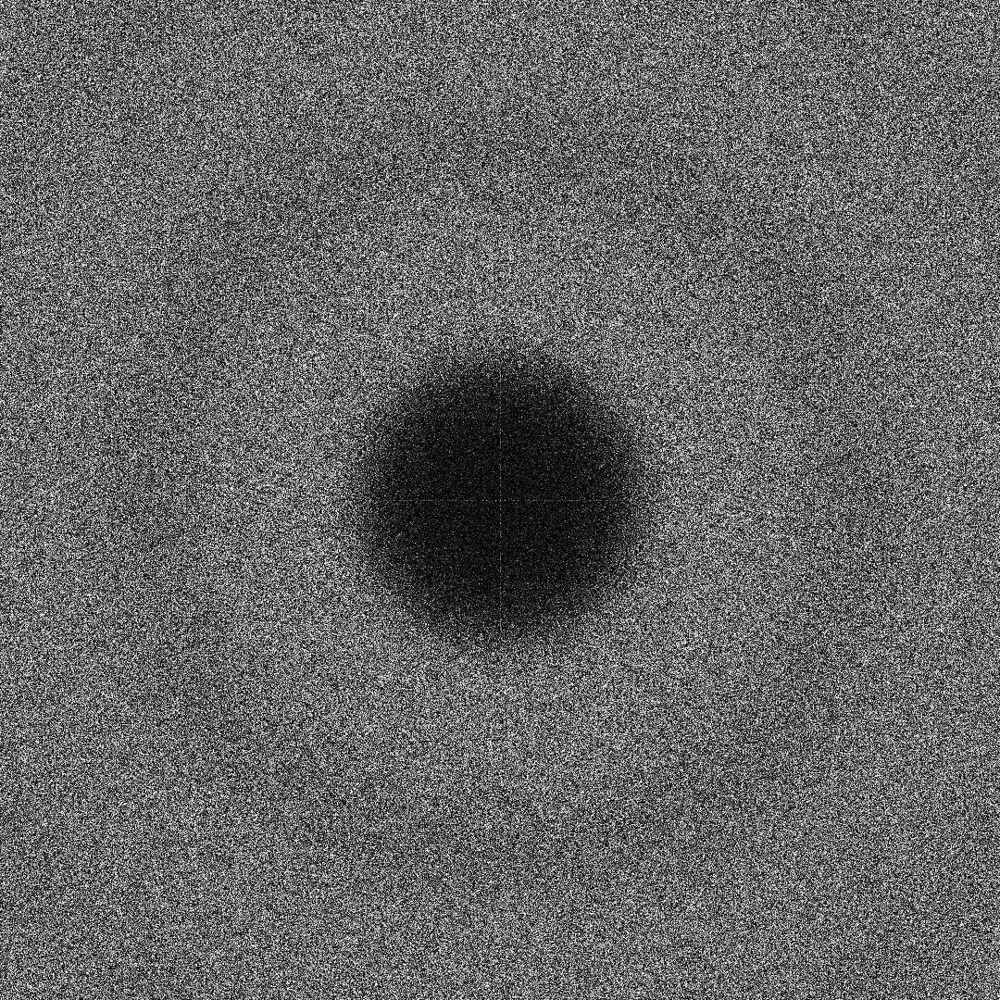
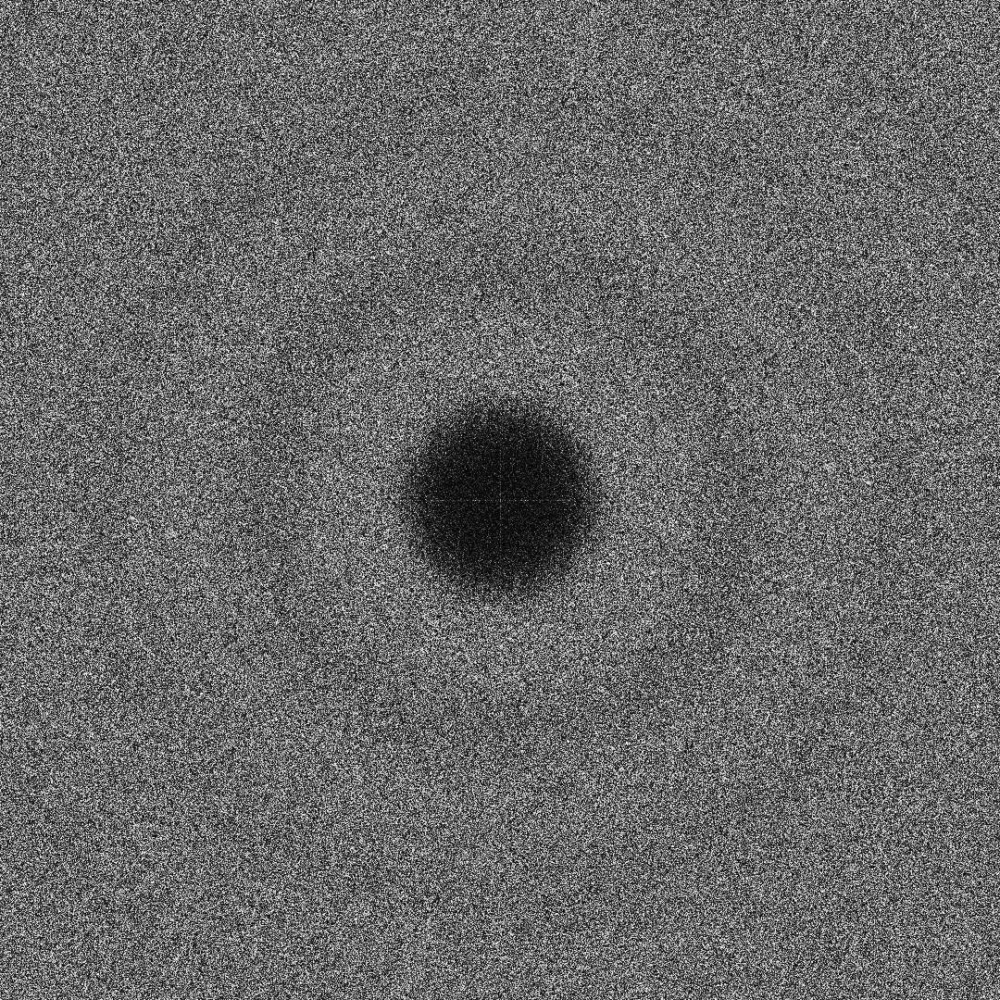
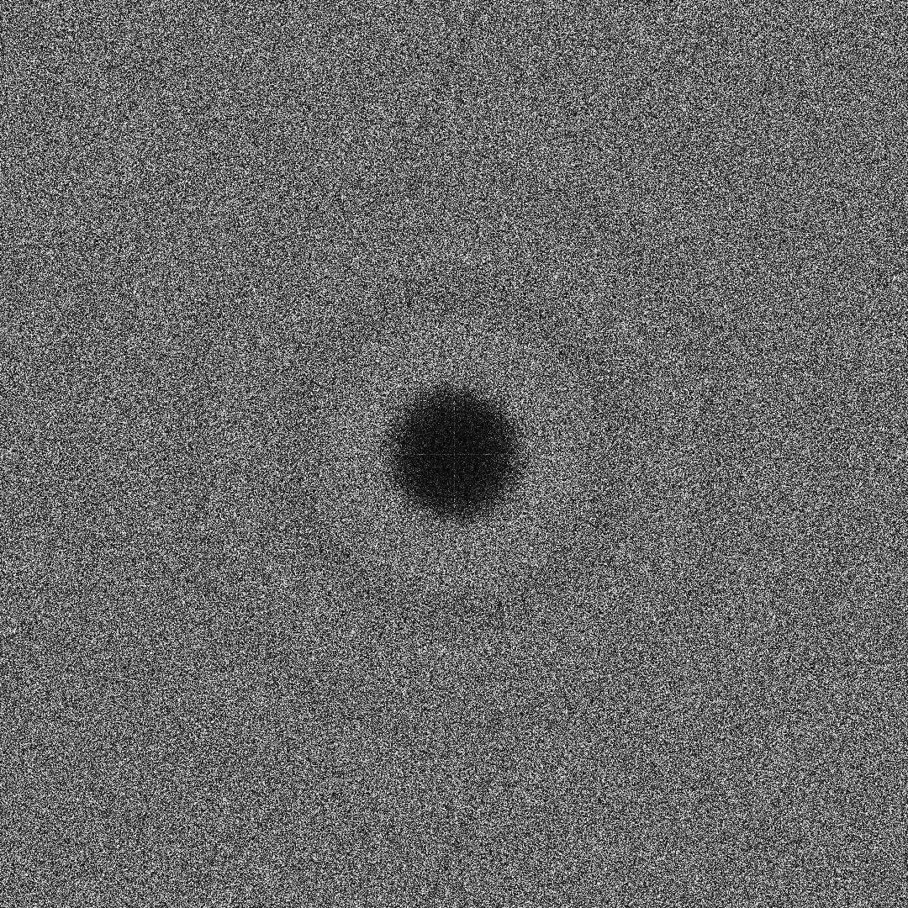
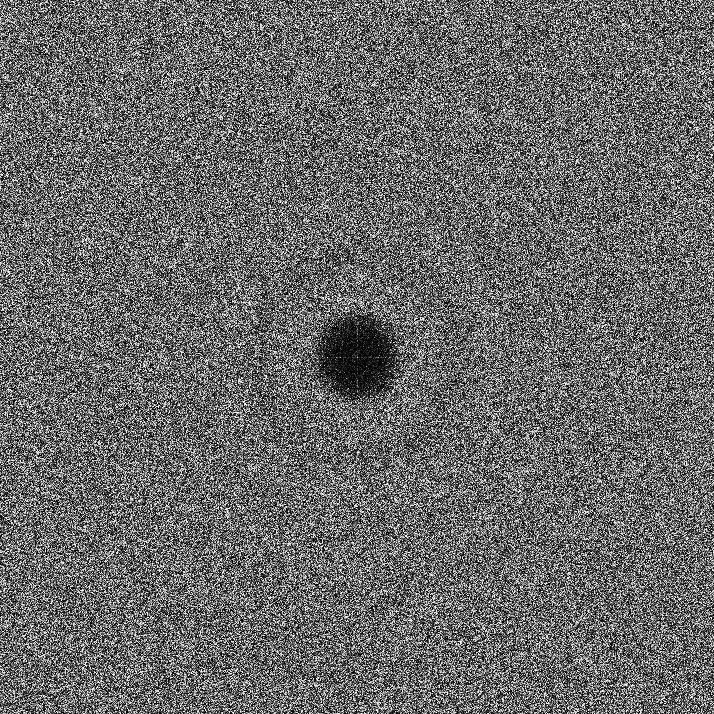
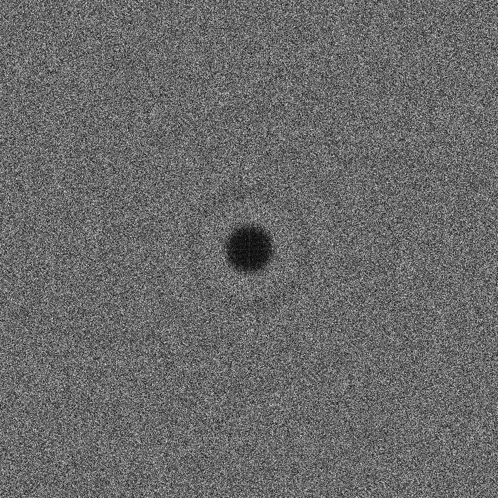
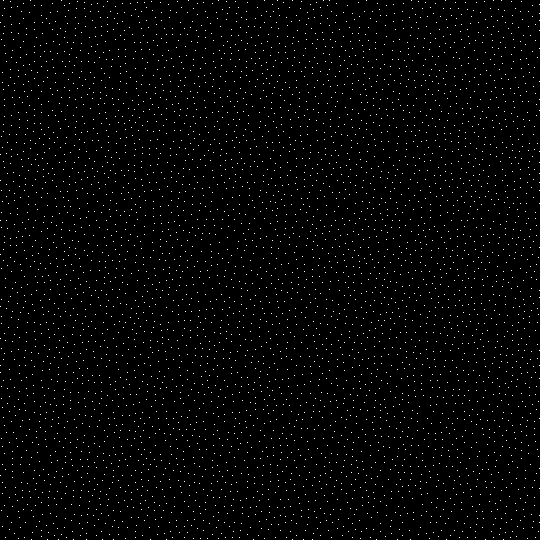

# 作业4 蓝噪采样
## 171860633 徐国栋
### 问题描述
1. 实现具有蓝噪频谱的二维空间随机采样点
2. 绘制生成的采样点的频谱,验证其蓝噪特性
3. 计算生成的采样点的discrepancy
### 解决思路
1. Fast Poisson disk sampling在二维空间的实现
* 根据文章"Fast Poisson disk sampling in arbitrary dimensions, R. Bridson, ACM SIGGRAPH 2007 Sketches"实现二维空间采样
* 算法复述如下：
  1. 初始化二维网格，网格边长为$r/\sqrt{2}$，初始化 active list 为空
  2. 随机选择第一个样本点$x_{0}$，将$x_{0}$插入网格、插入active list
  3. 循环直到active list为空，每一次循环中，随机从active list中取走一个点$p$，随机在点$p$周围半径$r$到$2r$的圆环里取k个点，使用网格检查这k个点在不在对应网格周边或者是否已经存在于采样结果，如果都不是，那么插入网格、标记对应位置的点为已经存在、将这个点插入active list。注意到网格最终将被填满，active list中的点会不再增加、被不断取走直到为空，循环会终止
* 为了支持把采样点数目作为输入，观察r=8时采样面积和采样点数目的关系【main.cpp, findRelationBetweenNumAndSize()函数】，使用w=h=$\sqrt{(num*107)}$作为采样点数目等于num时的采样区域边长
* 代码实现在src/poissondisk.cpp中，函数功能如下：
    ```cpp
    // 随机获得点p周围半径r到2r中的一个点
    inline Point getNeighbor(const Point &p) const;
    // 从网格中检查点p是否合法
    bool isValidNeighbor(const Point &p) const;
    // 检查点p是否在采样区域中
    inline bool isInArea(const Point &p) const;
    // Fast Poisson disk sampling算法的标准实现
    // result变量返回区域[w, h]中的采样点，采样点间隔控制参数为r，周边点生成尝试次数为k
    void fastPoissonDiskSampling(std::vector<Point>& result, float _r, int _width, int _height, int _k);
    // result变量返回大约num个采样点，Fast Poisson disk sampling算法中的r=8，
    // 根据数据点拟合结果推算采样区域大小，采样区域大小[sqrt(num * 107), sqrt(num * 107)]
    // 频谱分辨率和采样区域关联，s=(w+h)/8，计算频谱时，建议的num大于2000
    void fastPoissonDiskSampling(std::vector<Point>& result, const int num)
    ``` 
2. 傅里叶频谱分析
* 根据公式
$$\begin{aligned}
P(\mathbf{f}) &=\frac{1}{N}\left|\sum_{k=0}^{N-1} e^{-2 \pi i\left(\mathbf{f} \cdot \mathbf{s}_{\mathbf{k}}\right)}\right|^{2} \\
&=\frac{1}{N}\left(\sum_{k=0}^{N-1} \cos \left(2 \pi \mathbf{f} \cdot \mathbf{s}_{\mathbf{k}}\right)\right)^{2}+\frac{1}{N}\left(\sum_{k=0}^{N-1} \sin \left(2 \pi \mathbf{f} \cdot \mathbf{s}_{\mathbf{k}}\right)\right)^{2}
\end{aligned}$$
* $f$*$S_{k}$表示频谱图坐标和采样图坐标的点积，设$size$为频谱图的半宽，$w$、$h$为采样区域的长宽，$samplePoints$为采样点序列，具体实现如下：
  ```cpp
  void getFourierPowerSpectrum(std::vector<std::vector<float>>& result,
	const int size, const int w, const int h, const vector<Point>& samplePoints) {
    result.resize(2 * size); // [2*size, 2*size]
    for (auto& i : result) { i.resize(2 * size, 0); }
    const float N = samplePoints.size();
    vector<Point> tmpSample = samplePoints;
    for (auto& p : tmpSample) {
      p.x *= (2.0 * M_PI / (float)w);
      p.y *= (2.0 * M_PI / (float)h);
    }
    #pragma omp parallel for
    for (int i = -size; i < size; i++) {
      for (int j = -size; j < size; j++) {
        float s = 0, c = 0, tmp;
        for (const auto& p : tmpSample) {
          tmp = i * p.x + j * p.y;
          c += cos(tmp);
          s += sin(tmp);
        }
        result[i + size][j + size] = 255.0 / N * (c * c + s * s);
      }
    }
  }
  ```
3. 采样点的discrepancy计算
* 根据公式
$$\begin{aligned}
&D_{N}(B, P)=\sup _{b \in B}\left|\frac{\#\left\{x_{i} \in b\right\}}{N}-V(b)\right|\\
&B=\left\{\left[0, v_{1}\right] \times\left[0, v_{2}\right] \times \cdots \times\left[0, v_{n}\right]\right\}
\end{aligned}$$
* 取(0,0)为固定点，考虑另一个定点如何选取，让采样区域[$w$×$h$]内部的每一个点成为该定点，即公式里的$v_{1},v_{2},...,v_{n}$，计算所有情况下的discrepancy，取最大值作为最终结果
* 设$w$、$h$为采样区域的长宽，$samplePoints$为采样点序列，具体实现如下：
  ```cpp
  float getDiscrepancy(const int w, const int h,const vector<Point>& samplePoints) {
    const float N = samplePoints.size(), S = w * h;
    float n, s, result = numeric_limits<float>::min();
    for (int x = 1; x < w; x++) {
      for (int y = 1; y < h; y++) {
        n = 0;
        s = x * y;
        for (auto& j : samplePoints) {
          n += (j.x <= x && j.y <= y);
        }
        result = max(result, fabs(n / N - s / S));
      }
    }
    return result;
  }
  ```
### 测试案例和效果演示
#### 运行环境
* linux下运行，显示图像要求具有pthread和X11库
```txt
cmake .
make -j 2
./bns
```
* windows下运行，对c++编译器无特殊要求
```txt
cmake .
msbuild bns.sln /p:Configuration=Release -m
.\bns.exe
```
```cpp
int main(){}
	//testNumInput(); //  输出采样点个数vector<int> nums = { 500,1000,2000,4000,8000,16000 }的结果并保存
	//testRInput();   //  固定采样区域w=h=540, 傅里叶能量谱s=540,输出r={2,3,4,5,6}的结果并保存
	interact();       //  输入采样点个数，实时显示采样结果和傅里叶分析结果
	//findRelationBetweenNumAndSize(); // 输出一段matlab代码来观察采样点数量和采样面积的关系
	return 0;
}
```
#### 固定采样区域w=h=540, 傅里叶能量谱s=540, 频谱结果如下：
<table width="100%" border="0" cellspacing="0" cellpadding="0">
  <tr>
<td align="center"></td>
<td align="center"></td>
<td align="center"></td>
<td align="center"></td>
<td align="center"></td>
</tr>
<tr>
    <td align="center">r=2, N=43327, discrepancy=0.002009</td>
    <td align="center">r=3, N=19300, discrepancy=0.003413</td>
    <td align="center">r=4, N=10900, discrepancy=0.004314</td>
    <td align="center">r=5, N=6964, discrepancy=0.006236</td>
    <td align="center">r=6, N=4804, discrepancy=0.008483</td>
  </tr>
</table>

#### 将采样点数量作为输入，interact()函数的运行结果


#### r=6的采样结果显示如下：


### 结论
1. 采样点具有蓝噪特性
<table width="100%" border="0" cellspacing="0" cellpadding="0">
  <tr>
<td align="center"></td>
<td align="center"></td>
<td align="center"></td>
<td align="center"></td>
<td align="center"></td>
</tr>
<tr>
    <td align="center">r=2, N=43327, discrepancy=0.002009</td>
    <td align="center">r=3, N=19300, discrepancy=0.003413</td>
    <td align="center">r=4, N=10900, discrepancy=0.004314</td>
    <td align="center">r=5, N=6964, discrepancy=0.006236</td>
    <td align="center">r=6, N=4804, discrepancy=0.008483</td>
  </tr>
</table>

2. $r$ 越小，$discrepancy$ 越小
