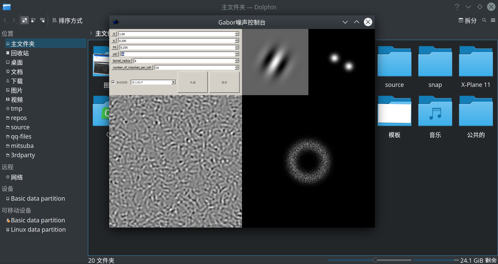

# 纹理生成控制器运行说明

## 使用简介

* 下拉菜单控制噪声或纹理的生成任务类型
* 复选框控制各向异性和各向同性
* 用鼠标滚轮或者键盘调整参数取值
* 点击生成按钮，显示生成结果
* 点击保存按钮，在当前文件夹保存生成结果
* 花瓶条纹使用了较高的网格脉冲数，达不到实时性
* 默认参数几乎可以实时显示所有噪声和纹理效果，如有卡顿，可以调低 number_of_impluses_per_cell 参数

## GaborNoise.exe

* 这是一个静态编译的windows-x64可执行程序
* 在 win7/win10 下可双击运行
* 在linux下可直接通过命令 wine64 GaborNoise.exe 启动

## linux-bin/GaborNoise

* 这是一个静态编译的linux-x64可执行程序，linux-bin下其它文件是利用ldd命令打包的所有运行时库
* 提交到github的仓库里没有这个目录，因为太大了。

